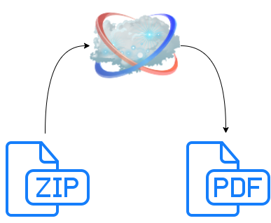

# latexserver
API server for compiling latex projects

# Author
Xiao Zhang

# Motivation
Many modern applications need to generate PDF files for printing or other purposes. Paged printing requires typesetting by nature. However typesetting is not as easy. Therefore it is neccessary to adopt an existing typesetting system.

LaTeX has been arount for decades. It is the most popular free typesetting system in the world. Therefore it is chosen to be the backend.

# Architecture


As shown above, this service only acts as an online compiler. LaTeX projects are submitted as a zip tarball, PDF output is then returned as the response.

# Installation
```
npm i
npm start
```
Now the server is up and listening on port 3011

# Usage
Each project must be submitted in the following format:
- method: POST
- endpoint: /new
- body:
  - engine: [see below](#engine)
  - timeout: [see below](#timeout)
  - input: [see below](#input)

## Engine
  The default engine is pdflatex. xelatex is recommended for most cases. **Try compile locally first before changing engine**

## Timeout
  The default timeout is 10000 ms. Maximum timeout is 30000 ms.

## Input
  The project file must be submitted as a zip tarball.
